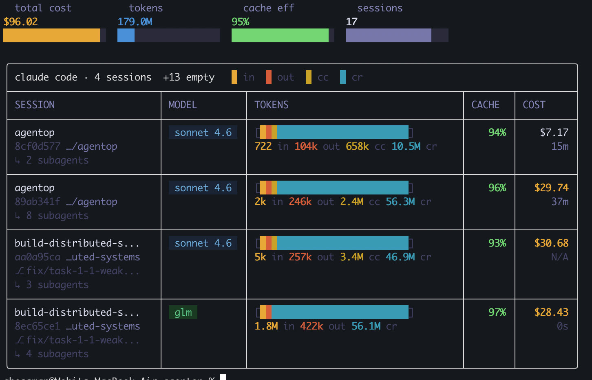

# agentop

*"What gets measured gets managed."* — Peter Drucker

A terminal dashboard for AI coding assistant sessions. Token usage, cost, and cache efficiency at a glance.

[](https://go.dev/)
[](LICENSE)
[](https://x.com/chessMan786)

---

## What It Does

Reads your AI assistant's session data and shows you what it is actually doing with your tokens.



### Default View

```bash
$ agentop

  total cost        tokens            cache eff         sessions
$106.39           266.2M            98%               9

╭─  claude code · 9 sessions  ────────────────────────────────────────╮
│ █ in █ out █ cc █ cr                                               │
│ ───────────────────────────────────────────────────────────────────│
│ Session                 Tokens                Cache  Cost Time     │
│ ───────────────────────────────────────────────────────────────────│
│ cfa91ba2  glm            [███████████████████]  98%  $1.89   29m   │
│ /Users/chessman/Desktop/Pro...  64k in · 36k out · 3.8M cr         │
│ ───────────────────────────────────────────────────────────────────│
│ 02ac7e59  glm            [███████████████████]  98% $40.69 23h13m  │
│ /Users/chessman/Desktop/Pro...  1.6M in · 511k out · 93.8M cr      │
│   +10 subagents, 0 tokens                                          │
╰─────────────────────────────────────────────────────────────────────╯
```

### Table View

```bash
$ agentop --layout table

┌──────────────────────────────────────────────────────────────────────────────┐
│ 9 sessions                                                                   │
├──────────────────────┬─────────┬───────────────────────┬───────┬────────┬───┤
│ SESSION              │ MODEL   │ TOKENS                │ CACHE │   COST │ T │
├──────────────────────┼─────────┼───────────────────────┼───────┼────────┼───┤
│ cfa91ba2             │ glm-4.7 │ [███████████████████] │   98% │  $1.89 │ 2 │
│                      │         │ 64k in · 36k out      │       │        │   │
│ 02ac7e59             │ glm-4.7 │ [███████████████████] │   98% │ $40.69 │ 2 │
│                      │         │ 1.6M in · 511k out    │       │        │   │
└──────────────────────┴─────────┴───────────────────────┴───────┴────────┴───┘
```

## Features

- **Beautiful Visual Design**: Clean interface with semantic colors (teal for cache reads, warm colors for costs)
- **Multiple Layouts**: Default panel view or table layout with `--layout table`
- **Interactive Watch Mode**: Keyboard navigation (↑/↓), sort cycling (s), help (?), status bar
- **Color Themes**: Auto-detects terminal theme (dark/light), supports ansi mode
- **Visual Indicators**: Progress bars, sparklines, trend indicators, threshold badges
- **Smart Filtering**: By date, project, model, cache efficiency
- **Anomaly Detection**: Flags cold starts, high-cost sessions, cache inefficiencies
- **Multi-OS Support**: Linux, FreeBSD, OpenBSD, macOS, Windows with wide architecture support

## Install

### Prebuilt Binaries (Recommended)

**[Download v0.1.0](https://github.com/mohitmishra786/agentop/releases/tag/v0.1.0)**

Available for:
- **Linux**: x86_64, arm64, i386, armv6, armv7, ppc64le, riscv64
- **FreeBSD**: x86_64, arm64, i386, armv6, armv7
- **OpenBSD**: x86_64, arm64, i386, armv6, armv7
- **macOS**: x86_64 (Intel), arm64 (Apple Silicon)
- **Windows**: x86_64, i386, arm64

Package formats: `.deb` (Debian/Ubuntu), `.rpm` (Fedora/RHEL), `.apk` (Alpine)

### Go Install

```bash
go install github.com/agentop-dev/agentop@v0.1.0
```

### Build from Source

```bash
git clone https://github.com/mohitmishra786/agentop.git
cd agentop
git checkout v0.1.0
make build
```

### Package Manager Support (Coming Soon)

We're working on getting agentop into major package managers:

**Linux**: Arch (pacman), Ubuntu/Debian (apt), Fedora (dnf), openSUSE (zypper), Nix, Void, Gentoo, Solus
**BSD**: FreeBSD (pkg), OpenBSD (pkg_add)
**macOS**: Homebrew, MacPorts
**Windows**: Chocolatey, Scoop
**Android**: Termux

Want to help? Consider packaging agentop for your favorite package manager!

## Usage

```bash
# Today's sessions (default layout)
agentop

# Table layout with clean columns
agentop --layout table

# Last 7 days
agentop --since 7d

# Filter by project
agentop --project myapp

# Filter by model
agentop --model sonnet

# Interactive watch mode with keyboard navigation
agentop --watch
# Press ? for help, ↑/↓ to navigate, s to sort, q to quit

# JSON output
agentop --json

# Anomaly detection
agentop doctor

# Deep-dive a session
agentop session <session-id>

# Daily breakdown
agentop daily

# Monthly breakdown
agentop monthly

# 5-hour billing windows
agentop blocks

# Show config and pricing
agentop config
```

## How It Works

Three things happen when you run `agentop`.

First, it discovers every JSONL session file — including subagent sessions. It handles the real directory structure where files live directly in project hash directories.

Second, it parses each session file and deduplicates by message ID. AI assistants stream responses, so the same message appears across multiple lines with zero token counts until the final chunk. The parser collects all chunks per message and only counts the final one. Sidechain events and tool-type users are filtered out.

Third, it calculates cost using the embedded pricing table. For providers that do not report `costUSD`, it falls back to token-based calculation. Sessions with no cost data show `~` instead of `$0.00`.

## Why This Exists

AI coding assistant sessions cost money. Real money. A single long session can burn through $40+ in tokens and most of it goes to cache reads that you did not know were happening.

The assistant UI shows you a chat log. It does not show you token breakdowns. It does not show you cache efficiency. It does not tell you that your first session of the day is paying a premium for cold-start cache creation.

**agentop** makes the invisible visible. You see which sessions are efficient, which ones are burning cash, and which models you are actually using. The anomaly detector (`agentop doctor`) flags sessions with poor cache efficiency, high cost for few messages, and model mismatches.

## Philosophy

*"The first principle is that you must not fool yourself — and you are the easiest person to fool."* — Richard Feynman

Most developers run AI coding assistants for weeks without checking what it costs. The token counts are buried in JSONL files. The cache efficiency is invisible. The billing windows are opaque.

This tool exists because transparency is the first step toward optimization. You cannot improve what you cannot measure.

## Roadmap

- [x] Claude Code support
- [ ] Codex CLI support
- [ ] OpenCode support
- [ ] Custom provider plugins
- [ ] Budget alerts
- [ ] Team/organization dashboards

## Contributing

Contributions are welcome. Here is how to get started:

```bash
git clone https://github.com/mohitmishra786/agentop.git
cd agentop
make test
```

The codebase is organized by layer:

```
cmd/              — CLI commands (cobra)
internal/claude/  — JSONL parsing and session discovery
internal/aggregator/ — Token aggregation and stats
internal/pricing/ — Model pricing engine
internal/ui/      — Terminal UI (bubbletea/lipgloss)
testdata/         — Sample session files
```

To add support for a new model, update `internal/pricing/pricing.json`. To add a new command, create a file in `cmd/` and register it in `cmd/root.go`. To add a new provider, create a new package under `internal/` and wire it into the aggregator.

Run tests before submitting a PR:

```bash
make test
```

## Security

- This tool reads your local session data. Nothing leaves your machine.
- No network calls are made. No telemetry. No analytics.
- The binary is a single Go binary with no runtime dependencies.
- If you find a security issue, please open a private issue or email the maintainer.

---

MIT License
